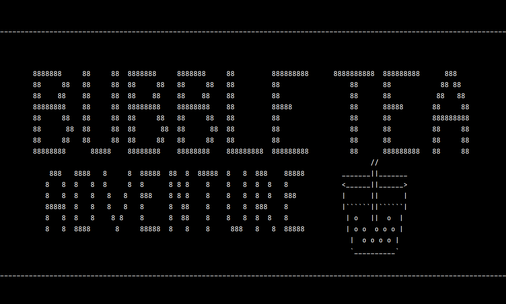

 
# Bubble Tea Adventure Game
A whacky text-based battle game where you play as a crazed Bubble Tea junky who constantly gets into fights at the Bubble Tea shop. You just can't handle your Bubble Tea!

## General Info 
I made this during week 7 of my software development course at _nology. 
This project was used to showcase knowledge of Classes and extending off a Class as well as accessing/changing properties via Getters and Setters. This game is purely text-based and played from the Terminal.

## Technologies used
* Java

## Steps of the game:
* Pick your name
* Pick how lucky you feel that day (luckier will make the game easier as you are more likely to do a Critical Hit on attack)
* Pick your favorite Bubble Tea (will be mentioned in game at various times)
* Round 1: Turn-based battle with Opponent 1. Attack or Heal.
* Round 2: Battle with Opponent 2.
* Round 3: Battle with your Boss, the Final Boss.
* If you defeat all 3 opponents before they take you down to 0 health, you win the game!

## Under the Hood
After deciding on how the game will work, I settled on 3 classes. "Person" is the first class and both the "Hero" and "Enemy" class extend from the "Person" class as both will share the same properties. Hero will have an additional property of "luck" which will be used to make the game easier/harder. Enemy has properties of "ugliness" which will determine if you take damage during your turn, and "rage" which if a higher number will make it more likely for the enemy to land a Critical Hit (works exactly the same as "luck" for the Hero). See below snippets of code from each class.
Now that I have my classes and have generated Getters and Setters to access the Hero and Enemy properties, I started to code the story and rounds of the game.

````javascript
public class Person {
    private int health = 100;
    private String name;
    private String tea;

    public Person(int health, String name, String tea) {
        this.health = health;
        this.name = name;
        this.tea = tea;
    } 

...

public class Hero extends Person{
    private int luck;

    public Hero(int health, String name, String tea, int luck) {
        super(health, name, tea);
        this.luck = luck;
    }

    ...

public class Enemy extends Person{
    private int ugliness;
    private int rage;

    public Enemy(int health, String name, String tea, int ugliness, int rage) {
        super(health, name, tea);
        this.ugliness = ugliness;
        this.rage = rage;
    }
````
To make the game more enjoyable, you cannot just immediately start battling opponents without some backstory. I start with lines upon lines of just setting the scene and taking the Hero player details. As I did not want all of the story text to be printed at once to the screen and wanted it to print at the same speed as the player could read the story, a 4th class called TypeWriter was created to print each character in the lines of text with a delay between each character. See below.

````javascript
public class TypeWriter {

    public static void type(String message) throws InterruptedException {
        // slowly print text
       for (char c: message.toCharArray()
             ) {
            System.out.print(c);
            Thread.sleep(10);
        }
        try
        {
            System.in.read();
        }
        catch(Exception e)
        {}
    }
}
````

At this point, the 3 enemies are initialized, the hero has been created, and it is time to start the battling. There are 3 rounds with a Hero turn and an Enemy turn. The Hero can Attack or Heal. Random number generators are compared to the luck, ugliness, and rage properties to determine if a Critical Hit is landed or if you take damage.
As all the rounds as similar, when I make my next update to this project, I will create a Round class to remove some repetition. Methods for heroAttack(), heroHeal(), enemyAttack(), and enemyHeal() will also be added for the same reasons.

Below is the code for the first round.
````javascript
// Round 1 (Opponent 1)

        for (int i = 0; i < 100; i++) {
            if (hero.getHealth() != 0 && enemy1.getHealth() != 0) {
                TypeWriter.type("Options: Enter 1 for ATTACK (does between 0-30 damage)   or   Enter 2 for HEAL (Replenish 20-30 life force by drinking some delicious tea");
                int choice = myScanner.nextInt();
                // Hero Attack Option
                if (choice == 1) {
                    int heroDamageRandom = (int) (Math.random() * (10) + 1);
                    if (heroDamageRandom < hero.getLuck() && heroDamageRandom != 1) {
                        TypeWriter.type("You throw a tapioca pearl right into their eye! That must have HURT to get hit by a small wet squishy sweet! You are feeling it today! Luck on your side!");
                        enemy1.setHealth(enemy1.getHealth() - 30);
                    } else if (heroDamageRandom > 1) {
                        int heroRandomAttack = (int) (Math.random() * (3) + 1);
                        if (heroRandomAttack == 1) {
                            TypeWriter.type("You shove the straw up your their nose! Savage!!!");
                        } else if (heroRandomAttack == 2) {
                            TypeWriter.type("You pull out some mom jokes and MAN did they hurt! They are down on one knee from the pain!");
                        } else {
                            TypeWriter.type("You whip your hair back and forth and slap well conditioned hair across your opponents ugly face");
                        }
                        enemy1.setHealth(enemy1.getHealth() - 20);
                    } else {
                        TypeWriter.type("You mistakenly punch yourself in the face! Pathetic!");
                        hero.setHealth(hero.getHealth() - 10);
                        TypeWriter.type("You are down to " + hero.getHealth() + "health");
                    }
                    if (enemy1.getHealth() < 0) {
                        enemy1.setHealth(0);
                    }
                    if (enemy1.getHealth() > 0) {
                        TypeWriter.type("Enemy has " + enemy1.getHealth() + " health left.");
                    } else {
                        TypeWriter.type("Enemy has 0 health left and lie in a puddle of bubble tea!");
                        TypeWriter.type(" ");
                        TypeWriter.type("You win!");
                    }
                    int uglinessDamageRandom = (int) (Math.random() * (10) + 1);
                    if (enemy1.getUgliness() > uglinessDamageRandom) {
                        hero.setHealth(hero.getHealth()-5);
                        if (hero.getHealth() < 0) {
                            hero.setHealth(0);
                        }
                        TypeWriter.type("You forget to shield your eyes and sustain damage from the ugliness of your opponent.. You have " + hero.getHealth() + " health left.");
                        if (hero.getHealth() == 0) {
                            TypeWriter.type("You just couldn't handle all the ugly and get knocked out!");
                        }

                    }
                }
                // Hero Heal Option
                if (choice == 2) {
                    int heroHealRandom = (int) (Math.random() * (10) + 20);
                    hero.setHealth(hero.getHealth() + heroHealRandom);
                    if (hero.getHealth() > 100) {
                        hero.setHealth(100);
                    }
                    if (heroHealRandom >= 26) {
                        TypeWriter.type("You take a sip of tea and have all the luck! You sucked up a Tapioca pearl and are feeling recharged! You have " + hero.getHealth() + " now.");
                    } else {
                        TypeWriter.type("You take this chance to take a sip of tea but NO TAPIOCA CAME UP THE STRAW...minimal heal.. You have " + hero.getHealth() + " now.");
                    }
                }
                if (enemy1.getHealth() != 0) {
                    int enemyRandomMove = (int) (Math.random() * (2) + 1);
                    // Enemy Attack Option
                    if (enemyRandomMove == 1) {
                        TypeWriter.type(enemy1.getName() + " Attacks!");
                        int enemyDamageRandom = (int) (Math.random() * (10) + 1);
                        if (enemyDamageRandom < enemy1.getRage() && enemyDamageRandom != 1) {
                            TypeWriter.type("He grabs another person in line over their head and throws them on top of you!! A rare and painful move!");
                            hero.setHealth(hero.getHealth() - 30);
                        } else if (enemyDamageRandom > 1) {
                            int enemyRandomAttack = (int) (Math.random() * (3) + 1);
                            if (enemyRandomAttack == 1) {
                                TypeWriter.type("Somebody has been watching the Karate Kid! You take a crane kick to the FACE!");
                            } else if (enemyRandomAttack == 2) {
                                TypeWriter.type("'What's that?' and points at your chest. OH NO, you fell for it! Finger smashes your nose when you look down! What a loser!");
                            } else {
                                TypeWriter.type("Classic hair pull! He knows how to get you where it hurts!");
                            }
                            hero.setHealth(hero.getHealth() - 20);
                        } else {
                            TypeWriter.type("He goes in for a flying kick and completely misses! Flies through the window of the Bubble Tea Shop and takes an Innocent out with them");
                            enemy1.setHealth(enemy1.getHealth() - 10);
                            if (enemy1.getHealth() < 0) {
                                enemy1.setHealth(0);
                            }
                            TypeWriter.type("He is one tough badger but he has " + enemy1.getHealth() + " health left now.");
                        }
                        if (hero.getHealth() < 0) {
                            hero.setHealth(0);
                        }
                        TypeWriter.type("You now have " + hero.getHealth() + " health.");
                    }
                    // Enemy Heal Option
                    if (enemyRandomMove == 2) {
                        TypeWriter.type(enemy1.getName() + " Heals...Boring but effective");
                        enemy1.setHealth(enemy1.getHealth() + 20);
                        if (enemy1.getHealth() > 100) {
                            enemy1.setHealth(100);
                        }
                        TypeWriter.type("Enemy now has " + enemy1.getHealth() + " health.");
                    }
                    if (hero.getHealth() == 0) {
                        TypeWriter.type("You lose!");
                    }
                }
            }
        }
````

## Download the code and play! Much of this game is an inside joke between myself and my coworkers and I found it very enjoyable to say the least :) 
